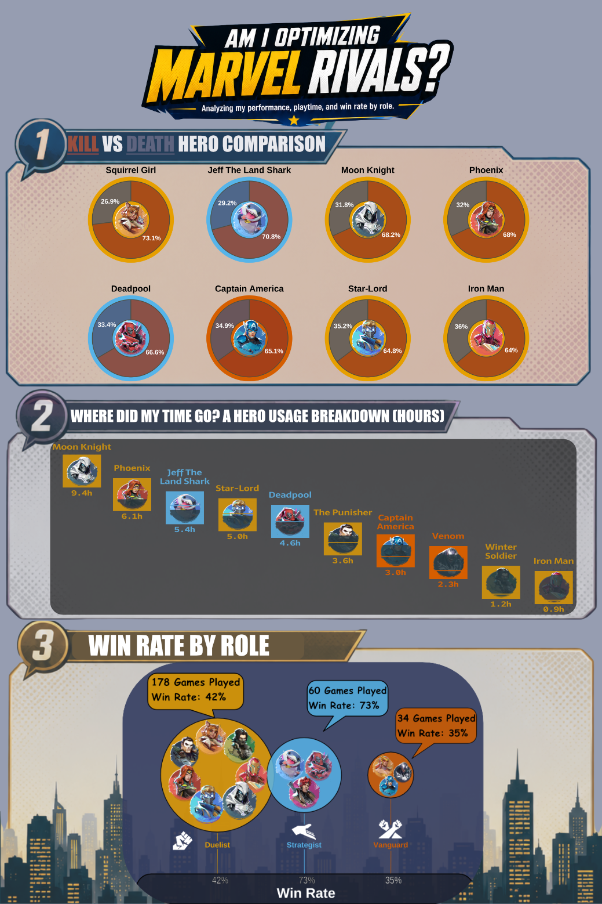

# What is so good about Marvel Rivals

Do you like or `LOVE` Marvel superheroes? Have you ever wondered if there was a game where you could actually use the powers of your favorite heroes? Look no further. Marvel has created a free video game, Marvel Rivals, that can be played across multiple platforms including PlayStation, Xbox, and PC.

In Marvel Rivals, new characters, maps, and skins are released as new seasons arrive. The game also includes hidden messages, dialogue, story elements, and Easter eggs that help expand the Marvel universe and give more depth to each character. Now that I’ve hyped up the game a bit, let’s talk about why I’m writing about it in the first place.

One of my hobbies is playing this game on my PlayStation when I have some downtime, need to relieve stress, or just want to jump into a quick match. I also know several people who play, which makes it a fun way to be competitive or just mess around. Of course, there’s always a bit of trash talk involved, but who doesn’t enjoy a little competitive banter?
Marvel Rivals is played in 5 vs. 5 team matches, and there are three main game modes:

```         
- Convoy: An escort mode where the attacking team pushes a payload to a destination while defenders try to stop them.
- Domination: A King of the Hill-style mode where teams capture and hold a control point.
- Convergence: A hybrid mode where teams capture a point that later turns into a payload escort objective.
```
Convoy and Convergence can be played in two formats: Quick Match or Competitive. Quick Match is more casual with lower stakes, while Competitive matches have higher stakes and allow players to rank up their heroes. Reaching higher ranks eventually achieving the title of Lord, it can be both exciting and challenging.

Using the website [Marvel Rivals Tracker](https://rivalsmeta.com/), I set up an API to download my personal gameplay statistics from Seasons 3–6. Below, I show how I retrieved my data using my gamer tag. I will only be looking into my hero usage and roles, yet I did not look into the game modes.

#### Marvel Rivals Display

The top image is a map called Yggsgard, known from the stories of Thor, Loki, and Asgard. The bottom image is a map called Shin-Shibuya, inspired by technology and cyberpunk aesthetics often associated with the Marvel hero Spider-Man Island storyline. While the middle highlights four playable heroes. From left to right: Cloak, Invisible Woman, Moon Knight, and The Punisher. On the background we can see a skyline and buildings from the cities.


# Main Question:
## Am I optimizing my Marvel Rivals gameplay?
- To explore this question, I will combine data from both Competitive and Quick Match games to analyze my performance across different heroes and roles.

# Libraries Used

```{r, warning=FALSE, message=FALSE, eval=TRUE, echo=TRUE}

library(tidyverse)
library(here)
library(dplyr)
library(ggimage)
library(patchwork)
library(glue)
library(showtext)
library(ggtext)
library(ggpath)
library(magick)
library(forcats)
library(sysfonts)

#......................import Google fonts.......................
# `name` is the name of the font as it appears in Google Fonts
# `family` is the user-specified id that you'll use to apply a font in your ggplot

font.add.google(name = "Sarala", family = "sarala")


font.add.google(name = "Noto Sans", family = "noto-sans")

font.add.google(name = "Red Hat Mono", family = "red")

#....................import Font Awesome fonts...................
font_add(family = "fa-brands",
         regular = here::here("/Users/marietolteca/Documents/MEDS/personal_website/marietolteca00.github.io/blog_post/MarvelRivals_post/fonts/Font Awesome 7 Brands-Regular-400.otf"))
```

# Import Data
Creating these CSV's can be found in `drafting_viz` in the repository `Tolteca-eds240-infographic`.

```{r, warning=FALSE,message=FALSE, eval=TRUE, echo=TRUE}
hero_kd_summary <- read.csv(here("/Users/marietolteca/Documents/MEDS/personal_website/marietolteca00.github.io/blog_post/MarvelRivals_post/data/hero_kd_summary.csv"))
role_stats <- read.csv(here("/Users/marietolteca/Documents/MEDS/personal_website/marietolteca00.github.io/blog_post/MarvelRivals_post/data/role_stats.csv"))
clean_season <- read.csv(here("/Users/marietolteca/Documents/MEDS/personal_website/marietolteca00.github.io/blog_post/MarvelRivals_post/data/clean_season.csv"))
```

> Create an API via Marvel Rivals API Website

# Data Wrangle

I made CSV's for the data wrangled, when I began my data exploration but will add in code chunks to show how it was done

```{r, eval=FALSE, echo=TRUE}
# Games from Season 3-6 for both Quick Match and Competitive - Using API
Created functions and for-loop to grab seasons 3-5 for Marvel Rival for my own status.

api_key <- "KEY"
USERNAME <- "kpil11"

# Define the function first
get_matches_by_mode <- function(username, season, game_mode, api_key) {
  Sys.sleep(2)  # Delay to avoid rate limits
  
  response <- GET(
    url = paste0("https://marvelrivalsapi.com/api/v1/player/", username, "/match-history"),
    query = list(
      season = season,
      game_mode = game_mode
    ),
    add_headers("x-api-key" = api_key)
  )
  
  if (status_code(response) == 200) {
    data <- fromJSON(content(response, "text", encoding = "UTF-8"))
    return(data$match_history)
  } else {
    warning(paste("Error:", status_code(response)))
    return(NULL)
  }
}

# For - loop
seasons <- 3:7
game_modes <- c(0, 1)
all_data <- list()

for (season in seasons) {
  for (mode in game_modes) {
    mode_name <- ifelse(mode == 1, "Competitive", "Quick")
    cat("Fetching Season", season, "-", mode_name, "...\n")
    
    matches <- get_matches_by_mode(USERNAME, season, mode, api_key)
    
    if (!is.null(matches)) {
      df <- bind_rows(matches)
      df$season <- season
      df$mode <- mode_name
      all_data[[paste(season, mode_name)]] <- df
    }
    # Allow to rerun without having an error from server
    Sys.sleep(5)
  }
}

all_season_combined <- bind_rows(all_data)

# Data from API
clean_season <- all_season_combined %>%
  # Rename and replace the column names to have a simple naming convention
  transmute(
    map_id = match_map_id,
    
    # Convert seconds → minutes
    duration = round(match_play_duration / 60, 2),
    duration_hours = round(match_play_duration / 60 / 60, 2),

    
    season,
    mode,
    timestamp = match_time_stamp,
    map = map_thumbnail,

    
    kills = match_player$kills,
    deaths = match_player$deaths,
    assists = match_player$assists,
    is_win = match_player$is_win$is_win,
    
    hero_name = tolower(match_player$player_hero$hero_name), 
    hero_type = match_player$player_hero$hero_type,
    hero_image = match_player$player_hero$hero_portrait,
    
    total_hero_damage = match_player$player_hero$total_hero_damage,
    total_damage_taken = match_player$player_hero$total_damage_taken,
    total_hero_healing = match_player$player_hero$total_hero_heal
    ) %>% 
  
  # Fixing Label for Hero
  mutate(
    hero_name = ifelse(hero_name == "unknown hero",
                       "deadpool",
                       hero_name)) %>% 
  group_by(map_id) %>%
  mutate(map_total = n()) %>%
  ungroup()

# K/D summary by role AND hero
hero_kd_summary <- clean_season %>%
  #mutate(hero_name = str_to_title(hero_name)) %>% 
  group_by(role, hero_name) %>%
  summarise(
    total_kills = sum(kills),
    total_deaths = sum(deaths),
    avg_kills = mean(kills),
    avg_deaths = mean(deaths),
    kd_ratio = sum(kills) / sum(deaths),
    games = n(),
    .groups = "drop"
  ) %>%
  # Get data from even a match
  filter(games >= 1) %>% 
    mutate(
      # Embed Good Images for Heroes
    image_url = case_when(
      hero_name == "phoenix" ~ "https://rivalskins.com/wp-content/uploads/marvel-assets/items/spray/40/img_phoenix.png",
      hero_name == "captain america" ~ "https://rivalskins.com/wp-content/uploads/marvel-assets/items/spray/3/img_captain-america.png",
      hero_name == "moon knight" ~ "https://rivalskins.com/wp-content/uploads/marvel-assets/items/spray/16/img_moon-knight.png",
      hero_name == "star-lord" ~ "https://rivalskins.com/wp-content/uploads/marvel-assets/items/spray/24/img_star-lord.png",
      hero_name == "the punisher" ~ "https://rivalskins.com/wp-content/uploads/marvel-assets/items/spray/20/img_icon_the-punisher.webp",
      hero_name == "winter soldier" ~ "https://rivalskins.com/wp-content/uploads/marvel-assets/items/spray/28/img_winter-soldier.webp",
      hero_name == "jeff the land shark" ~ "https://rivalskins.com/wp-content/uploads/marvel-assets/items/spray/10/img_jeff-the-land-shark.webp",
      hero_name == "venom" ~ "https://rivalskins.com/wp-content/uploads/marvel-assets/items/spray/27/img_venom.webp",
      hero_name == "squirrel girl" ~ "https://rivalskins.com/wp-content/uploads/marvel-assets/items/spray/32/img_squirrel-girl.webp",
      TRUE ~ image_url))

# Win rate by role
role_stats <- clean_season %>%
  group_by(role) %>%
  summarise(
    games = n(),
    win_rate = mean(win_rate == "Win"))

# Kills/ Death Percent Ratios
hero_polar <- hero_kd_summary %>%
  mutate(
    hero_name = str_to_title(hero_name),
    hero_name = reorder(hero_name, -avg_kills)
  ) %>%
  select(hero_name, avg_kills, avg_deaths, role, image_url) %>%
  pivot_longer(cols = c(avg_kills, avg_deaths),
               names_to  = "stat",
               values_to = "value") %>%
  mutate(stat_label = ifelse(stat == "avg_kills", "Kills", "Deaths")) %>%
  group_by(hero_name) %>%
  mutate(
    # Percent Ratio
    pct   = value / sum(value),
    y_pos = cumsum(pct) - 0.5 * pct
  ) %>%
  ungroup()
```

# Type of Visualizations:
### Hero Duration
This visualization explores which heroes I spend the most time playing. By grouping heroes by role, I can see whether I tend to favor certain characters or roles more during matches.

### Kill v Death Hero Comparison
For this plot, I want to compare the number of kills and deaths across the heroes I play. This helps identify which heroes I perform best with in terms of securing kills while staying alive. I also include each hero’s role to see if performance varies between roles.

### Win Rate per Hero Role
This plot looks at my average win rate across the different roles. It also shows which roles I have played the most games in, helping me understand whether playtime or role choice influences my success in matches.
```{r,warning=FALSE, message=FALSE ,eval=FALSE, echo=TRUE}
#| fig-width: 15
#| fig-height: 8
#| out-width: "100%"
#| fig-alt: "Scatter plot showing hours played for each hero, with portrait icons indicating the proportion of total playtime used. Moon Knight has the highest playtime at approximately 9.4 hours, followed by Phoenix at about 6.1 hours. Several heroes such as Angela, Gambit, and Squirrel Girl show minimal playtime of around 0.3 hours."


# ── Role colors ──────────────────────────────────────────────

role_colors_hex <- c(
  "Duelist"    = "#C58D12",
  "Vanguard"   = "#D55E00",
  "Strategist" = "#5AA6D4"
)

hero_usage <- clean_season %>%
  group_by(hero_name, role) %>%
  summarise(
    total_duration_min   = sum(duration, na.rm = TRUE),
    total_duration_hours = round(sum(duration, na.rm = TRUE) / 60, 2),
    .groups = "drop"
  ) %>%
  arrange(desc(total_duration_min))

top_heroes <- hero_usage %>%
  slice_max(order_by = total_duration_min, n = 10) %>%
  mutate(hero_name = str_to_title(hero_name))

# ── Data ──────────────────────────────────────────────────────

max_hours_scalar <- max(top_heroes$total_duration_hours, na.rm = TRUE)

# Join image URLs from hero_kd_summary (title-cased to match)
hero_images <- hero_kd_summary %>%
  mutate(hero_name = str_to_title(hero_name)) %>%
  distinct(hero_name, image_url)

plot_df <- top_heroes %>%
  left_join(hero_images, by = "hero_name") %>%
  mutate(fraction = total_duration_hours / max_hours_scalar) %>%
  arrange(desc(total_duration_hours))

hero_order <- plot_df$hero_name

# ── Portrait maker ────────────────────────────────────────────
SIZE <- 160L

make_composite_portrait <- function(image_url, fraction, role, hero_name) {
  col       <- role_colors_hex[[role]]
  grey_rows <- max(0L, round((1 - fraction) * SIZE))
  vis_rows  <- SIZE - grey_rows

  img <- tryCatch({
    magick::image_read(image_url) %>%
      magick::image_resize(paste0(SIZE, "x", SIZE, "!")) %>%
      magick::image_convert(colorspace = "sRGB")
  }, error = function(e) {
    message("  ! Failed: ", hero_name)
    magick::image_blank(SIZE, SIZE, color = col)
  })

  if (vis_rows <= 0L) {
    composite <- magick::image_colorize(img, opacity = 85, color = "#2B3C43")
  } else if (grey_rows <= 0L) {
    composite <- img
  } else {
    full_grey    <- magick::image_colorize(img, opacity = 85, color = "#2B3C43")
    colour_strip <- magick::image_crop(img, paste0(SIZE, "x", vis_rows, "+0+0"))
    composite    <- magick::image_composite(full_grey, colour_strip,
                                            operator = "Over", offset = "+0+0")
  }

  if (grey_rows > 3L && grey_rows < SIZE - 3L) {
    divider   <- magick::image_blank(SIZE, 4L, color = col)
    composite <- magick::image_composite(composite, divider,
                                         operator = "Over",
                                         offset   = paste0("+0+", grey_rows - 2L))
  }

  composite <- magick::image_extent(composite,
                                    geometry = paste0(SIZE + 8L, "x", SIZE + 8L),
                                    gravity  = "Center", color = col)
  tmp <- tempfile(fileext = ".png")
  magick::image_write(composite, tmp, format = "png")
  tmp
}

message("Generating portraits...")
plot_df <- plot_df %>%
  rowwise() %>%
  mutate(bubble_img = make_composite_portrait(image_url, fraction, role, hero_name)) %>%
  ungroup()
message("Done.")

# ── Enable showtext (correct function name) ───────────────────

showtext_auto(enable = TRUE)
showtext_opts(dpi = 300)

title_dur <- glue::glue(
  "<span style='font-family:noto-sans; font-weight:bold;'>Where Did My Time Go? A Hero Usage Breakdown (Hours)</span>"
)

#.........................plot.........................

max_h <- max_hours_scalar

y_offset <- (max_h + 2.0 - (-1.0)) * 0.14

# Plot Starts

duration <- ggplot(plot_df, aes(x = hero_name, y = total_duration_hours)) +
  
  # Size of bubble
  geom_image(aes(image = bubble_img), size = 0.09, asp = 12 / 9) +
  
   # Name label — push further above the larger bubble
  geom_text(
    aes(y     = total_duration_hours + y_offset,  # was 0.99
        label = stringr::str_wrap(hero_name, width = 12),
        color = role),
    family = "sarala", size = 6.5, fontface = "bold",
    hjust = 0.5, lineheight = 0.90        # hjust 0.5 centers it properly
  ) +

  # Hours label — push further below
  geom_text(
    aes(y     = total_duration_hours - y_offset * 0.7,  # was -0.75
        label = sprintf("%.1fh", total_duration_hours),
        color = role),
    family = "red", size = 6, fontface = "bold"
  ) +
  
  
  scale_color_manual(values = role_colors_hex, guide = "none") +
  scale_x_discrete(limits = hero_order) +
  scale_y_continuous(
    limits = c(-2.5, max_h + 3.5),
    breaks = seq(0, ceiling(max_h), by = 2),
    expand = expansion(mult = c(0, 0))
  ) +
  labs(
    #title    = title_dur,
    subtitle = "Portrait fill shows Proportion of Max Playtime \u2022 Dark Grey = Unused Portion",
    x        = NULL,
    y        = NULL,
    caption  = make_caption()
  ) +
  theme_minimal(base_family = "noto-sans", base_size = 13) +
  theme(
    #plot.background    = element_rect(fill = "lightgrey", color = "#BCC7AA", linewidth = 3),
    #panel.background   = element_rect(fill = "azure2"),
    axis.text.x        = element_blank(),
    axis.text.y        = element_blank(),
    axis.title.x       = element_blank(),
    axis.title.y       = element_blank(),
    axis.ticks         = element_blank(),
    panel.grid.major.x = element_blank(),
    #panel.grid.major.y = element_line(color = "#cccccc80", linewidth = 0.4),
    panel.grid.minor   = element_blank(),
    legend.position    = "none",
    plot.margin        = margin(t = 0.5, r = 0.5, b = 0.5, l = 0.5, unit = "cm"),
    #plot.title         = ggtext::element_markdown(
     # family = "noto-sans", face = "bold", size = 24,
      #hjust = 0.5, color = "#333333", margin = margin(b = 8)
    #),
    plot.subtitle = element_text(
      family = "sarala", hjust = 0.5, size = 15,
      color = "#666666", margin = margin(b = 15)
    ),
    plot.caption = ggtext::element_markdown(
      family = "noto-sans", face = "italic", size = 10,
      hjust = 1, margin = margin(t = 15), lineheight = 1.5, color = "#888888"
    )
  )

duration
showtext_auto(enable = FALSE)


# Kill/ Death Percent Ratio  Hero Comparison
##| fig-width: 13
##| fig-height: 14
##| out-width: "100%"

##| fig-alt: "Grid of donut charts comparing the percentage of kills versus deaths for multiple heroes across Duelist, Strategist, and Vanguard roles. Most heroes show a higher percentage of kills than deaths. Duelists such as Squirrel Girl, Moon Knight, Iron Man, Phoenix, and Star-Lord have kill percentages between roughly 64–73%. Strategists and Vanguards show slightly more balanced ratios, with heroes like Winter Soldier and The Punisher close to 50/50."
##| fig-cap: "Kill to death ratios across heroes. Donut charts show the proportion of kills (orange) and deaths (gray) for each hero. Most heroes achieve more kills than deaths, particularly Duelists who are designed for damage output. Some characters such as Winter Soldier and The Punisher have more balanced ratios, suggesting higher risk or frontline engagement during matches."

#showtext.auto(enable = TRUE)

title <- glue::glue("<span style='color:#99381E;'>Kill</span>
                    <span style='color:#000000;'>vs</span>
                    <span style='color:#4E5472;'>Death</span>
                    <span style='color:#000000;'>Hero Comparison</span>")

github_icon <- "\uf09b"
github_username <- "Marietolteca00"

caption <- glue::glue(
  "Data Source: ©2026 MARVEL <br>
  <span style='font-family:fa-brands;'>{github_icon}</span>
  {github_username}"
)

#.........................data prep.........................
hero_polar <- hero_kd_summary %>%
  filter(str_to_title(hero_name) != "Angela") %>%
  mutate(
    hero_name   = str_to_title(hero_name),
    death_ratio = avg_deaths / (avg_kills + avg_deaths),
    hero_name   = fct_reorder(hero_name, death_ratio, .desc = FALSE),
    role_color  = case_when(
      role == "Duelist"    ~ "#E69F00",
      role == "Strategist" ~ "#56B4E9",
      role == "Vanguard"   ~ "#D55E00"
    )
  ) %>%
  select(hero_name, avg_kills, avg_deaths, role, role_color, image_url) %>%
  pivot_longer(cols = c(avg_kills, avg_deaths),
               names_to  = "stat",
               values_to = "value") %>%
  mutate(stat_label = ifelse(stat == "avg_kills", "Kills", "Deaths")) %>%
  group_by(hero_name) %>%
  mutate(
    pct   = value / sum(value),
    y_pos = cumsum(pct) - 0.5 * pct
  ) %>%
  ungroup()
# Recreate bg_data AFTER filtering
bg_data <- hero_polar %>%
  distinct(hero_name, role_color)

#.........................plot.........................
showtext_auto(enable = TRUE)

title_kd <- glue::glue(
  "<span style='color:#99381E;'>Kill</span>
   <span style='color:#000000;'>vs</span>
   <span style='color:#4E5472;'>Death</span>
   <span style='color:#000000;'>Hero Comparison</span>"
)

kd_plot1 <- hero_polar %>%
  ggplot() +
  geom_rect(
    data = bg_data,
    aes(fill = role_color),
    xmin = -Inf, xmax = Inf, ymin = -Inf, ymax = Inf
  ) +
  scale_fill_identity() +
  # Images for Heroes
  geom_from_path(
    data = hero_polar %>% distinct(hero_name, .keep_all = TRUE),
    aes(x = 0, y = 0, path = image_url),
    width = 0.36, vjust = 0.54
  ) +
  # Size of Columns
  geom_col(
    aes(x = 5, y = pct,
        fill = ifelse(stat_label == "Kills", "#99381E", "#4E5472")),
    width = 4.2, alpha = 0.8,
    color = "#4D4E40", linewidth = 0.6
  ) +
  # Percent Ratios
  geom_text(
    data = . %>% filter(value > 0),
    aes(x = 4.8, y = y_pos,
        label = paste0(round(pct * 100, 1), "%")),
    size = 4.5, fontface = "bold", color = "white"
  ) +
  geom_text(
    data = hero_polar %>% distinct(hero_name, role, .keep_all = TRUE),
    aes(x = 0, y = 0, label = hero_name),
    color = "black", size = 6, fontface = "bold", vjust = -7
  ) +
  facet_wrap(~hero_name, ncol = 4) +
  scale_fill_identity() +
  coord_polar("y") +
  # Background of Heroes
  xlim(-1, 8) +
  labs(title = title_kd, caption = make_caption()) +
  theme_void() +
  theme(
    #plot.background  = element_rect(fill = "lightgrey", color = "aliceblue", linewidth = 3),
    panel.background = element_blank(),
    strip.text       = element_blank(),
    strip.background = element_blank(),
    legend.position  = "none",
    plot.margin      = margin(t = 0.5, r = 0.5, b = 0.5, l = 0.5, unit = "cm"),
    panel.spacing    = unit(1.5, "lines"),
    plot.title       = ggtext::element_markdown(
      family = "noto-sans", face = "bold", size = 25,
      hjust = 0.5, color = "#ACAB97", margin = margin(b = 10)
    ),
    plot.caption = ggtext::element_markdown(
      face = "italic", size = 12, margin = margin(t = 15), lineheight = 1.5
    )
  )

kd_plot1
#showtext_auto(enable = FALSE)
---
# Win Rate Plot
### Edits Were made on Affinity
##| fig-alt: "Bubble chart showing win rate across three roles: Vanguard, Duelist, and Strategist. Bubble size represents the number of games played. Strategists appear to have the highest win rate (around the mid-70% range), Duelists show moderate win rates around 50%, and Vanguards have lower win rates near 30%."
##| fig-cap: "Win rate differences across roles. The chart compares average win rate for Vanguard, Duelist, and Strategist roles, with bubble size representing the number of matches played. Strategists show the highest win rates, while Duelists have moderate success and Vanguards show lower win rates overall. These patterns suggest that team support roles may have stronger influence on match outcomes."
# Edits were made on Affinity
#knitr::include_graphics(here::here("blog_post","MarvelRivals_post","NEW_WIN_RATE.png"))

# Data Wrangle
# Pull one image_url per role from hero_kd_summary
role_image <- hero_kd_summary %>%
  filter(!is.na(image_url)) %>%
  group_by(role) %>%
  slice(1) %>%
  ungroup() %>%
  select(role, image_url)

role_stats4 <- role_stats %>%
  left_join(role_image, by = "role")

max_games  <- max(role_stats4$games)
size_range <- c(20, 60)
x_range    <- 1
y_range    <- 0.4

role_stats4 <- role_stats4 %>%
  group_by(role) %>%
  mutate(
    hero_index = row_number(),
    n_heroes   = n(),
    pt_size    = size_range[1] + (games / max_games) * (size_range[2] - size_range[1]),
    r          = pt_size * 0.0008,
    angle      = 2 * pi * (hero_index - 1) / n_heroes,
    image_x    = win_rate + r * cos(angle),
    image_y    = 1 + (r * (x_range / y_range) * 0.15) * sin(angle)
  ) %>%
  ungroup()

# Plot dimensions to correct aspect ratio
x_range <- 1       # 0 to 1 (0% to 100%)
y_range <- 0.4     # approximate y range visible in plot

role_stats4 <- role_stats4 %>%
  group_by(role) %>%
  mutate(
    pt_size = size_range[1] + (games / max_games) * (size_range[2] - size_range[1]),
    r = pt_size * 0.0008,
    angle = 2 * pi * (hero_index - 1) / n_heroes,
    image_x = win_rate + r * cos(angle),
    image_y = 1 + (r * (x_range / y_range) * 0.15) * sin(angle)  
  ) %>%
  ungroup()


#..........................create title..........................
title <- glue::glue("<span style='color:#000000;'>Win</span>
                    <span style='color:#000000;'>Rate</span>
                    <span style='color:#ACAB97;'>by</span>
                    <span style='color:#000000;'>Role</span>")

#.........................create caption.........................

github_icon <- "\uf09b"
github_username <- "marietolteca00"

caption <- glue::glue(
  "Data Source: ©2026 MARVEL <br>
  <span style='font-family:fa-brands;'>{github_icon}</span>
  {github_username}"
)

#.........................plot.........................
#| fig-width: 10
#| fig-height: 5
#| out-width: "100%"

#showtext_auto(enable = TRUE)

role_colors_wr <- c(
  "Duelist"    = "#E69F00",
  "Strategist" = "#56B4E9",
  "Vanguard"   = "#D55E00"
)

# Hero images arranged in a circle inside each role bubble
max_games  <- max(role_stats4$games)
#size_range <- c(20, 60)
size_range <- c(40, 100)

hero_positions <- role_stats4 %>%
  group_by(role) %>%
  mutate(
    n         = n(),
    angle     = 2 * pi * (row_number() - 1) / n,
    r         = 0.04,                          # radius of hero orbit; tweak as needed
    img_x     = win_rate + r * cos(angle),
    img_y     = 1       + r * 0.4 * sin(angle) # 0.4 squishes vertically for aspect ratio
  ) %>%
  ungroup()

# Role Labels 
role_labels <- role_stats4 %>%
  distinct(role, win_rate, games) %>%
  mutate(x_pos = c(0.25, 0.50, 0.75))  # evenly spaced; reorder if needed


# Start Plotting

win_rate <- ggplot(role_labels, aes(x = x_pos, y = 1)) +

  # Main role bubble
  geom_point(aes(size = games, fill = role), shape = 21, alpha = 0.85, color = "black", stroke = 1) +

  # Hero images inside bubble
  geom_image(
    data = hero_positions,
    aes(x = img_x, y = img_y, image = image_url),
    size = 0.055
  ) +

  # Role label below bubble
  geom_text(
    aes(y = 0.92, label = role, color = role),
    fontface = "bold", size = 5
  ) +

  # Win rate % below role label
  geom_text(
    aes(y = 0.895, label = scales::percent(win_rate, accuracy = 1)),
    color = "white", size = 4
  ) +

  # Games played above bubble
  geom_text(
    aes(y = 1.1, label = paste0(games, " games")),
    color = "white", size = 3.5, fontface = "italic"
  ) +

  scale_size_continuous(range = size_range) +
  scale_fill_manual(values  = role_colors_wr) +
  scale_color_manual(values = role_colors_wr) +
  #scale_x_continuous(labels = scales::percent, limits = c(0, 1)) +
  scale_x_continuous(
  breaks = c(0.25, 0.50, 0.75),
  labels = c("Vanguard", "Duelist", "Strategist"),  # match your role order
  limits = c(0, 1)
) +
  scale_y_continuous(limits = c(0.87, 1.15)) +

  labs(
    #title    = title_wr,
    #subtitle = "Bubble size represents games played",
    x        = "Win Rate",
    y        = "",
    caption  = make_caption()
  ) +

  theme_void() +
  theme(
    plot.background    = element_rect(fill = "#343A51", color = "#8b0000", linewidth = 4),
    panel.background   = element_rect(fill = NA),
    panel.grid.major.x = element_line(color = "#ffffff30", linewidth = 0.4, linetype = "dashed"),
    axis.text.x        = element_text(size = 13, color = "#c0c0c0", margin = margin(t = 8)),
    axis.title.x       = element_text(size = 14, color = "#ffffff", face = "bold", margin = margin(t = 8)),
    legend.position    = "none",
    
    # Github and Data Source
    plot.caption = ggtext::element_markdown(
      face = "italic", size = 10, color = "#c0c0c0",
      margin = margin(t = 20), lineheight = 1.5, hjust = 0.98
    )
    
  ) +
  guides(fill = "none", color = "none", size = "none")

win_rate

#showtext_auto(enable = FALSE)


```

# Findings
::: {.darkgrey-text .center-text}
*`Hero Duration` - Playtime distribution across heroes. The chart shows the number of hours played for each hero, with portrait fill indicating the proportion of maximum playtime. Moon Knight and Phoenix represent the most frequently played heroes, while several others have significantly lower playtime. This uneven distribution suggests player preference for specific characters during matches.*

*`Kill vs Death Hero Comparison Percent Ratios across heroes` - Donut charts show the proportion of kills (orange) and deaths (gray) for each hero. Most heroes achieve more kills than deaths, particularly Duelists who are designed for damage output. Some characters such as Winter Soldier and The Punisher have more balanced ratios, suggesting higher risk or frontline engagement during matches.*

*`Win rate differences across roles` - The chart compares average win rate for Vanguard, Duelist, and Strategist roles, with bubble size representing the number of matches played. Strategists show the highest win rates, while Duelists have moderate success and Vanguards show lower win rates overall. These patterns suggest that team support roles may have stronger influence on match outcomes.*
:::


# Infographic



> *Kill to death ratios are generally positive across heroes, particularly among Duelists. Despite this, win rates differ across roles, suggesting that success is not driven by damage alone. Strategic role changes based on team performance may be necessary to improve match outcomes*


# Special Note
Thank you for sticking around, below I have provided a GIF that shows Jeff the Shark, Healer/ Strategist, show the dub of the century and took the dub for the game!

As well as, Squirrel girl and Starlord!

::: {.darkgrey-text .center-text}
*Jeff the Shark is shown using his ultimate ability. This ability allows him to swallow both allies and enemies. The ultimate charges over the course of the game.*
*In this GIF, There is a blue shield that was added by invisible women (using her ultimate - Invisible Boundary) to protect her team from damage. Jeff can be seen swallowing two allies and four enemies. He spits out the allies before carrying the enemies into lava, eliminating them.*
*Jeff is being attacked throughout this process, which is why the screen pulses red around the edges.*
:::


::: {.darkgrey-text .center-text}
*Following Jeff the shark, I wanted to show a snippet of Squirrel Girl since she was my top Kills when comparing with other heroes. In this image, it is showing the highlight of a gameplay that was done in the match of domination. She is shown throwing her acorns at enemies to make damage and received a five player kill streak.*
:::


::: {.darkgrey-text .center-text}
*Lastly, we have Star-Lord giving his goodbye dance for staying until this point.*
:::

