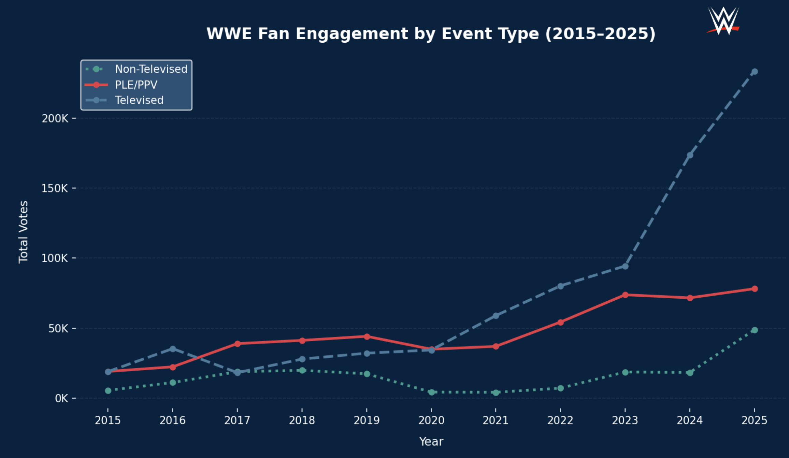
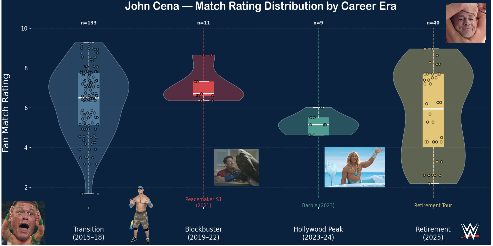

# WWE Events & Match Ratings Database (2015–2025)


---
## World Wrestling Entertainment (WWE) gathering datasets to make a database - Final Project for EDS 213

#### Author: Marie Tolteca, Student- Masters in Environmental Data Science
#### Date: May 13, 2026
---

A structured SQL database built from real WWE event and match rating data sourced from [Cagematch.net](https://www.cagematch.net) and the Wrestling Observer Newsletter (WON). 

This project demonstrates end-to-end data engineering and analytics skills from schema design and data ingestion to SQL querying and Python visualization.

---

## Table of Contents

- [Project Overview](#project-overview)
- [Dataset](#dataset)
- [Schema Design](#schema-design)
- [Data Cleaning](#data-cleaning)
- [Analysis Questions](#analysis-questions)
- [Visualizations](#visualizations)
- [Tech Stack](#tech-stack)
- [How to Run](#how-to-run)
- [Limitations & Future Work](#limitations--future-work)

---

## Project Overview

This project was built over 7 weeks as part of a database design course. The goal was to:

1. Choose a real-world dataset
2. Design a relational schema
3. Clean and ingest data into a SQL database
4. Write analytical SQL queries
5. Visualize results in Python
6. Document and present findings

The dataset covers **10 years of WWE programming** (2015–2025), including televised shows, non-televised live events, and premium live events (PLEs/PPVs).

---

## Dataset

**Source:** [Kaggle — WWE Events & Match Ratings (2015–2025)](https://www.kaggle.com/datasets/franchise403/wwe-events-and-match-ratings-20152025)
```
| File | Rows | Description |
|------|------|-------------|
| `wwe_events.csv` | 5,970 | Event-level data (show name, type, location) |
| `wwe_match_rating.csv` | 8,101 | Match-level data with fan and critic ratings |
```

**Rating Sources:**
- **CageMatch Rating** — crowdsourced fan ratings from **cagematch.net** (6,235 matches rated)
- **WON Star Rating** — critic ratings from Dave Meltzer's Wrestling Observer Newsletter (2,171 matches rated)

**Event Types:**
```
| Type | Count |
|------|-------|
| Televised | 3,261 |
| Non-Televised | 2,421 |
| PLE/PPV | 288 |
```

### Table Definitions
```
wwe_events — Event-level fact table
| Column | Type | Key |
|--------|------|-----|
| Date | DATE | PK |
| Promotion | TEXT | PK |
| Event | TEXT | |
| EventName | TEXT | |
| EventType | TEXT | |
| CityTown | TEXT | |
| StateProvince | TEXT | |
| Country | TEXT | |

wwe_match_rating — Match-level fact table
| Column | Type | Key |
|--------|------|-----|
| Index | INTEGER | PK |
| Date | DATE | FK → wwe_events |
| Promotion | TEXT | FK → wwe_events |
| Match | TEXT | |
| CageMatchRating | DECIMAL | |
| CageMatchRatingVotes | INTEGER | |
| WONStarRating | DECIMAL | |
| Opponent1 | TEXT | |
| Opponent2 | TEXT | |

tag_teams — Unpivoted tag team opponents
| Column | Type | Key |
|--------|------|-----|
| OpponentID | INTEGER | PK |
| MatchIndex | INTEGER | FK → wwe_match_rating |
| Team | TEXT | |

superstars — Unique superstar lookup table
| Column | Type | Key |
|--------|------|-----|
| SuperstarID | INTEGER | PK |
| SuperstarName | TEXT | |
```
---

## Data Cleaning

Cleaning was performed in R using the `tidyverse` package.

**Steps taken:**

- Dates were already in `YYYY-MM-DD` format and loaded as proper date types, no reformatting needed
- Numeric columns (`CageMatchRating`, `WONStarRating`, `CageMatchRatingVotes`) contained no text or mixed values
- Missing ratings represented as `NA` (expected: not every match is rated by both sources)
- Trailing commas removed from opponent strings (e.g. `"Raquel Rodriguez, Stephanie Vaquer,"`)
- Tag teams extracted by detecting `&` in opponent columns and pivoting to long format
- 515 duplicates looking rows in `wwe_events` are legitimate. WWE runs multiple house shows in different cities under the same event name on the same date

**Known limitation:** 81 match dates in `wwe_match_rating` have no corresponding row in `wwe_events`. These matches are excluded from any query that joins both tables.

### Tag Teams Table (R Code)

```r
library(dplyr)
library(tidyr)
library(stringr)

tag_teams <- match_rating %>%
  select(Index, Opponent.1, Opponent.2) %>%
  pivot_longer(
    cols = c(Opponent.1, Opponent.2),
    names_to = "Side",
    values_to = "Team"
  ) %>%
  mutate(Team = str_trim(str_replace_all(Team, ",\\s*$", ""))) %>%
  filter(str_detect(Team, "&")) %>%
  select(MatchIndex = Index, Team) %>%
  mutate(OpponentID = row_number()) %>%
  select(OpponentID, MatchIndex, Team)
```

---

## Analysis Questions

### Q1 — How has fan engagement varied across WWE event types from 2015 to 2025?

```sql
SELECT 
    YEAR(m.Date) AS Year,
    e.EventType,
    SUM(m.CageMatchRatingVotes) AS TotalVotes
FROM match_rating m
JOIN events e ON e.Date = m.Date AND e.Promotion = m.Promotion
GROUP BY Year, e.EventType
ORDER BY Year ASC, TotalVotes DESC;
```


---

### Q2 — Who are the top 20 highest rated WrestleMania superstars (2015–2025)?


```sql
SELECT s.SuperstarName,
       ROUND(AVG(m.CageMatchRating), 2) AS AvgRating,
       COUNT(*) AS MatchCount
FROM superstars s
JOIN wwe_match_rating m ON s.MatchIndex = m.Index
JOIN wwe_events e ON e.Date = m.Date AND e.Promotion = m.Promotion
WHERE e.Event = 'WWE WrestleMania'
GROUP BY s.SuperstarName
ORDER BY AvgRating DESC
LIMIT 20;
```

---

### Q3 — How did John Cena's performance vary across career eras?

📓 [`johncena_timeline.ipynb`](https://github.com/marietolteca00/WWE-database/tree/main/notebooks/johncena_timeline.ipynb)




---


## Tech Stack

| Tool | Purpose |
|------|---------|
| R / tidyverse | Data cleaning and ingestion |
| SQLite | Relational database |
| Python / pandas | Data manipulation |
| Python / matplotlib | Visualization |
| Kaggle | Data source |


```{python}


```

